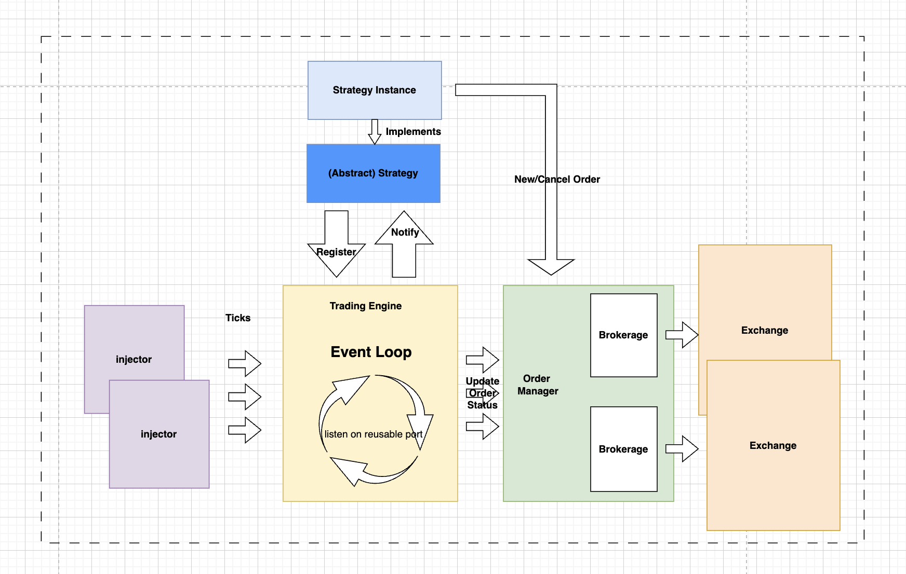

### saccade - trading platform

## 1. Get Started

> NOTE: only tested and verified locally on MAC M1 chip. No guarantee runnable on linux machine though the syscalls used are transferable (I'm sorry not enough time). 
>
> **Watch the screen recording for further verification**

### 1.1 build & run trading engine locally

```bash
saccade git:(master) ✗ cd src/engine
## build
engine git:(master) ✗ g++ -o engine_test engine_test.cpp -std=c++17
## run engine
engine git:(master) ✗ ./engine_test
```

### 1.2 build & run injector locally

```bash
saccade git:(master) ✗ cd src/injector
## build
injector git:(master) ✗ g++ -o injector_test injector_test.cpp -std=c++17
## run injector for SCH.log
injector git:(master) ✗ ./injector_test ../../data/SCH.log 239.255.10.10 4321
## run injector for SCS.log
injector git:(master) ✗ ./injector_test ../../data/SCS.log 239.255.10.10 4321
```

### 1.3 build & run exchange locally

```bash
saccade git:(master) ✗ cd src/exchange
# build
exchange git:(master) ✗ g++ -o exchange_test exchange_test.cpp -std=c++17
## run exchange for SCH
exchange git:(master) ✗ ./exchange_test test.exchange.SCH 8000
## run exchange for SCH
exchange git:(master) ✗ ./exchange_test test.exchange.SCS 8001
```


## 2. System Design

### 2.1 Architecture Diagram



### 2.2 Specifications

**The entire system consists of the following main components:**

1. **Trading Engine**

   **The trading engine initializes all brokers and strategies, register for strategies and starts looping for new events from injectors. It consists of order manager which is responsible for order life cycles. Order manager composes of a bunch of brokers and it interacts with exchange through broker interface.**

2. **Strategy**

   **Strategy moduldes provides interface for users to implement their trading algorithms. It is registered when the engine gets initialised.**

3. **Injector**

   **Two injectors to multicast udp packet to the nodes listening on the channel.**

4. **Exchange**

   **Two mock exchange to get engine request.**

5. **Order Book Building**

   **Order books are build upon the events by subscribing to event loops. It is kept within strategy for ease of reference.**


## 3. Performance

#### 3.1 Improvements

From a micro perspective, `send` and `recv` syscall ares used. Context switches to the kernel have a cost and it is be better to avoid it, changing to `sendmmsg` and `recvmmsg` would be better. (because my test environment is on mac)

#### 3.2 Performance Test

Two main parts to test:

1. How fast the engine picks up the `udp` packets from the injectors.
2. How fast the engine submit trade requests to the exchange through `tcp`

For 1, isolating the injectors and engine. reference https://blog.cloudflare.com/how-to-receive-a-million-packets/

For 2, isolating the exchange and engine and to test the performance of `tcp` calls
